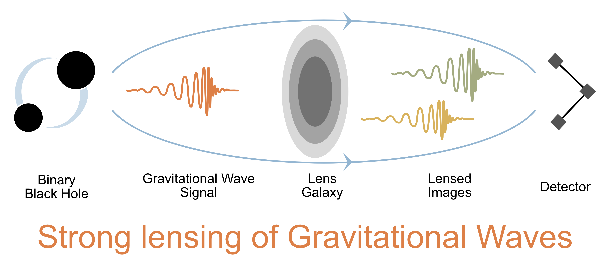

# LeR
[](https://zenodo.org/badge/latestdoi/626733473) [](https://badge.fury.io/py/ler) [](https://ler.readthedocs.io/en/latest/)

<p align="center">
  
</p>

## Installation

```
pip install ler
```

## About

<p align="center">
  
</p>

LeR is a Python package designed for the statistical simulation and forecasting of gravitational wave (GW) events and their rates. It is tailored to support both GW population study groups and GW lensing research groups by providing a comprehensive suite of tools for GW event analysis. The package is organized into the following main components:

## Sampling Gravitational Wave Source Properties:
- The source's redshift ($z_s$) sampling distribution, $R_m^U(z_s)$, is derived from the merger rate density of compact binaries, which is based on the star formation rate. The code is designed for easy integration of future updates or user-specified distributions.
- The sampling of both intrinsic and extrinsic parameters of GW sources, represented by $\theta_i$, utilizes the prior distributions ( $P\left(\theta_i \right)$ ) available within the `gwcosmo` and `bilby` Python packages. Users can manually alter any relevant parameters as needed.

## Lensing Related:
- **Sampling of Lens Galaxies Attributes and Source Redshifts:**
    - For lensed cases, the source redshift ($z_s$) is sampled under the strong lensing condition (SL) based on the precomputed probability of strong lensing with source at $z_s$ ( optical depth: $P\left(\text{SL}|z_s\right)$ ). This probability can be recalculated for specified configurations of lens galaxies, leveraging multiprocessing and njit functionalities for efficiency.
    - The package uses the Elliptical Power Law with external shear (EPL+Shear) model for galaxy parameter ($\theta_L$) sampling, following [Wierda et. al 2021](https://arxiv.org/abs/2106.06303). Rejection sampling is applied to these samples based on whether the event is strongly lensed or not, $P\left(\text{SL}|z_s,\theta_L\right)$.

- **Generation of Image Properties:**
    - Source position ($\beta$) is sampled from the caustic in the source plane.
    - Sampled lens properties and source position are fed into `Lenstronomy` to generate image properties. This is the slowest part of the simulation, which LeR tackles through parallelization with multiprocessing.
    - Image properties like magnification ($\mu_i$) and time delay ($\Delta t_i$) modify the original source signal strength, affecting the signal-to-noise ratio (SNR) and our ability to detect.

## Calculation of Detectable Merger Rates Per Year:
- The calculation of rates involves integration over simulated events that meet specific detection criteria, including computing SNRs ($\rho$) for each event or its lensed images and assessing them against a predetermined threshold ($\rho_{th}$).
- SNR calculations are optimized using [gwsnr](https://github.com/hemantaph/gwsnr), leveraging interpolation, artificial neural networks, and multiprocessing for accuracy and speed.
- Simulated events and rate results, along with input configurations, are systematically archived for easy access and future analysis. All interpolators used in the process are preserved for future applications.

LeR is developed to meet the needs of both the LIGO-Virgo-KAGRA Scientific Collaboration and researchers in astrophysics. It is currently used in generating detectable lensing events and GW lensing rates for current and future detectors, contributing to the ongoing effort to detect lensed GWs, ([arXiv:2306.03827](https://arxiv.org/abs/2306.03827)). The package is designed with upgradability in mind to include additional statistics as required by related research.

Key features of LeR include efficient sampling, optimized SNR calculations, and systematic archiving of results. It leverages array operations and linear algebra from the `numpy` library, interpolation methods from `scipy`, and parallel processing capabilities from Python's `multiprocessing` module, with performance further optimized using the `numba` library's Just-In-Time compilation.

For more information and usage examples, please refer to [LeR documentation](https://arxiv.org/abs/2306.03827).

**Detectable Gravitational Wave Event Rates:**

$$R_U = \int dz_s R_m^U(z_s) \; \Theta[\rho(z_s,\theta)-\rho_{th}] \; P(\theta) d\theta$$

* $z_s$: GW source redshift, $R_m^U(z_s)$: source frame merger rate density in the co-moving volume at $z_s$, $\theta$: GW source parameters, $P$: probability distribution, $\rho$: SNR, $\rho_{th}$: SNR threshold, $\Theta$: Heaviside function to select detectable events.

**Detectable Lensed Gravitational Wave Event Rates:**

$$ R_L = \int dz_s R_m^L(z_s) \,O_{images}(z_s,\theta,\mu_i,\Delta t_i, \rho_{th}) P(\theta) P(\theta_L|\text{SL},z_s) P(\beta|\text{SL}) d\theta d\beta d\theta_L dz_s $$

* $R_m^L(z_s)$: strongly lensed source frame merger rate density in the co-moving volume at $z_s$, $\theta_L$: lens parameters, $\beta$: image properties, $\mu$: image magnification, $\Delta t$: image time delay, $O_{images}$: logical OR operator applied across all $\Theta_i$ of the images, $\text{SL}$: strong lensing condition.

## Distribution binary black hole (BBH) in terms of redshift.

* The following plot generated using `LeR`. This considers O4 design sensitivity of the GW detectors.

<p align="center">
  
</p>

# Documentation

The `ler` package documentation is available at [ReadTheDocs](https://ler.readthedocs.io/en/latest).


