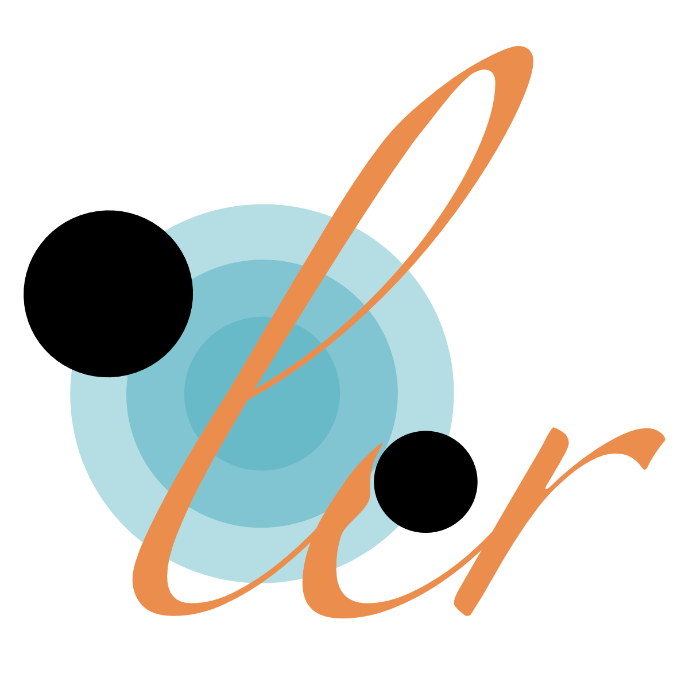

# LeR

[](https://doi.org/10.5281/zenodo.8087461)
[](https://badge.fury.io/py/ler)
[](https://ler.hemantaph.com/)

<p align="center">
  
</p>

`ler` is a statistics-based Python package for simulating compact-binary
gravitational-wave (GW) populations and calculating detectable event rates. It
supports both unlensed and strongly lensed events, with workflows for source
populations, lens populations, image properties, detector selection effects,
and rate estimation.

`ler` is intended for gravitational-wave population studies, lensing studies,
and forecasting for current and future detector networks.

## Installation

`ler` supports Python 3.10+; Python 3.11 is recommended in the
documentation.

Recommended installation with `uv`:

```bash
uv add ler
```

You can also install with `pip`:

```bash
pip install ler
```

For development, clone the repository and install in editable mode:

```bash
git clone https://github.com/hemantaph/ler.git
cd ler
pip install -e ".[dev]"
```

## Quick start

```python
from ler import LeR

ler = LeR(npool=4) # npool sets the number of parallel processes for sampling and integration. It should be set according to your system's capabilities.

# Generate simulated populations and save parameters in json files
unlensed_param = ler.unlensed_cbc_statistics(size=100000)
lensed_param = ler.lensed_cbc_statistics(size=100000)

# Calculate detectable rates, saving detected parameters in json files
unlensed_rate, unlensed_param_detected = ler.unlensed_rate()
lensed_rate, lensed_param_detected = ler.lensed_rate()

# Compare lensed and unlensed rates
ratio = ler.rate_ratio()
```

## What `ler` does

- samples compact-binary source populations, including BBH, BNS, and NSBH
  systems
- calculates detectable unlensed gravitational-wave event rates
- samples strongly lensed source and lens populations
- computes lensing image properties such as magnifications and time delays
- calculates detectable strongly lensed event rates using image-level
  detection criteria
- supports configurable source, lens, and detection models
- uses `gwsnr` for efficient signal-to-noise ratio and detection-probability
  calculations
- uses `lenstronomy` and in-house EPL+Shear routines for lensing calculations
- uses Monte Carlo integration, multiprocessing, and `numba`-compiled routines
  for large simulations

## Method overview

Unlensed rates are estimated by drawing source parameters from astrophysical
priors, evaluating the probability of detection, and averaging over the
population:

$$
\frac{\Delta N^{\mathrm{obs}}_{\mathrm{U}}}{\Delta t} = \mathcal{N}_{\mathrm{U}} \bigg\langle P(\mathrm{obs} \mid \vec{\theta}) \bigg\rangle_{\vec{\theta} \sim P(\vec{\theta})}
$$

Strongly lensed rates extend the same idea by sampling source redshift, lens
redshift, lens parameters, and source position under the strong-lensing
condition:

$$
\frac{\Delta N^{\mathrm{obs}}_{\mathrm{L}}}{\Delta t} = \mathcal{N}_{\mathrm{L}} \bigg\langle P(\mathrm{obs}\mid \vec{\theta}_{\mathrm{U}}, \vec{\theta}_{\mathrm{L}}, \vec{\beta}, \mathrm{SL}) \bigg\rangle_{\substack{ \vec{\theta}_{\mathrm{U}},\vec{\theta}_{\mathrm{L}} \sim P(\vec{\theta}_{\mathrm{U}},\vec{\theta}_{\mathrm{L}} \mid z_L, z_s, \mathrm{SL}) \\ \vec{\beta} \sim P(\vec{\beta} \mid z_s, \vec{\theta}_{\mathrm{L}}, \mathrm{SL}) }}
$$

The lensed workflow uses the optical depth, the multi-image caustic
cross-section, lens-equation solutions, and a requirement that at least two
lensed images satisfy the chosen detection criterion.

## Documentation

The documentation is available at:

https://ler.hemantaph.com/

Useful sections include:

- [Installation](https://ler.hemantaph.com/Installation.html)
- [Code overview](https://ler.hemantaph.com/code_overview.html)
- [Unlensed event-rate formulation](https://ler.hemantaph.com/analytical_formulation_unlensed.html)
- [Lensed event-rate formulation](https://ler.hemantaph.com/analytical_formulation_lensed.html)
- [Examples](https://ler.hemantaph.com/examples/LeR_short_examples.html)

## Community guidelines

Guidelines for contributing, reporting issues, and seeking support are available
in [CONTRIBUTING.md](CONTRIBUTING.md).

Issues can be reported at:

https://github.com/hemantaph/ler/issues

## Citation

If `ler` supports your research, please cite the project as described in the
documentation and repository metadata.
