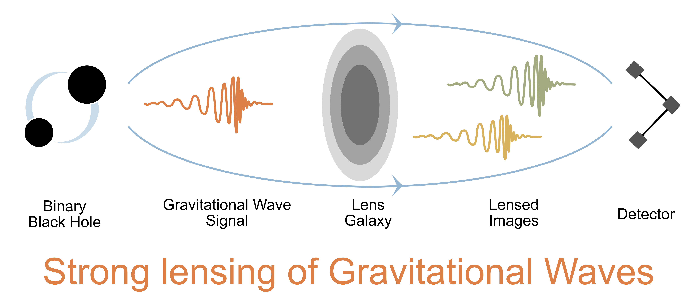
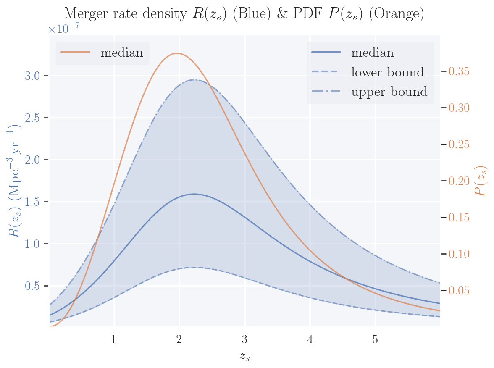
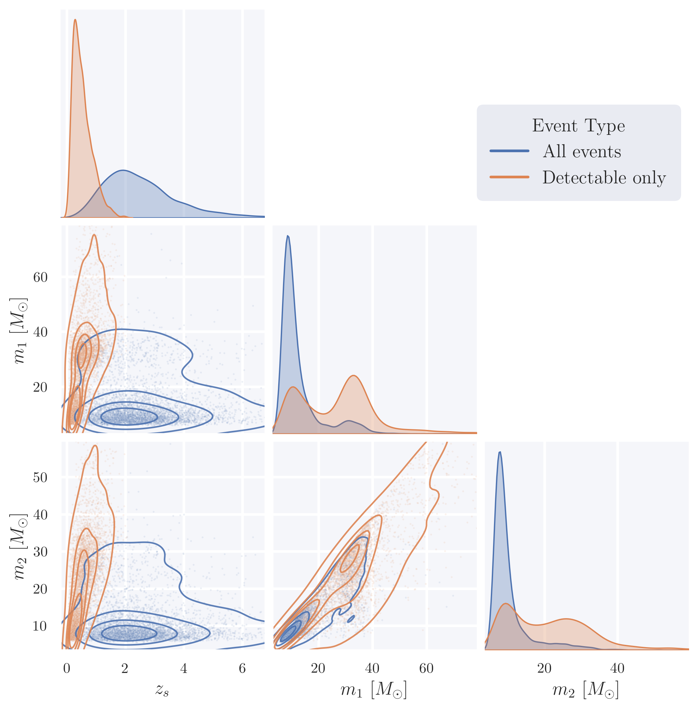
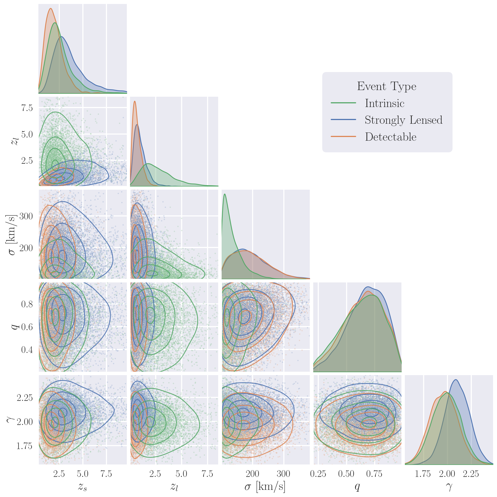

# Summary

    

<iframe src="_static/gwlensing_non_rotating.html"
        width="100%"
        height="450"
        frameborder="0"
        allowfullscreen
        style="border:1px solid #ccc; border-radius:10px;"></iframe>

*Animation showing the lensing of gravitational waves by a massive object.*

`ler` is a statistics-based Python package for simulating compact-binary
gravitational-wave populations and calculating detectable event rates. It
supports both unlensed and strongly lensed events.

The package is designed for gravitational-wave population studies, lensing
studies, and forecasting for current and future detector networks.

## Main workflow

`ler` separates the calculation into two related workflows.

For unlensed events, `ler`:

- samples compact-binary source properties
- evaluates detector-frame signal-to-noise ratios and detection probabilities
- estimates detectable event rates with Monte Carlo integration

For strongly lensed events, `ler` also:

- samples source and lens redshifts under the strong-lensing condition
- samples lens properties using the lensing cross-section
- samples source positions inside the multi-image caustic
- computes image positions, magnifications, time delays, and Morse phases
- applies image-level detection criteria
- estimates detectable lensed event rates

## Scientific models

`ler` supports compact-binary populations such as BBH, BNS, and NSBH systems.
The source-redshift distribution is based on merger-rate density and the
comoving volume element, including the detector-frame time-dilation factor.

For lensing calculations, the documentation describes the EPL+Shear model with
lens parameters such as lens redshift, velocity dispersion, axis ratio, lens
orientation, density slope, and external shear. The implementation uses optical
depth and multi-image caustic cross-section calculations to sample the strongly
lensed population.

Detector selection effects are evaluated through the `gwsnr` backend. The
default examples use an SNR threshold and waveform/detector settings described
in the analytical formulation pages.

## Rate calculation

The unlensed detectable rate is written as the intrinsic detector-frame rate
multiplied by the population-averaged detection probability:

$$
\frac{\Delta N^{\mathrm{obs}}_{\mathrm{U}}}{\Delta t} = \mathcal{N}_{\mathrm{U}} \bigg\langle P(\mathrm{obs} \mid \vec{\theta}) \bigg\rangle_{\vec{\theta} \sim P(\vec{\theta})}
$$

The strongly lensed detectable rate is computed by averaging the detection
probability over source parameters, lens parameters, and source position,
conditioned on strong lensing:

$$
\frac{\Delta N^{\mathrm{obs}}_{\mathrm{L}}}{\Delta t} = \mathcal{N}_{\mathrm{L}} \bigg\langle P(\mathrm{obs}\mid \vec{\theta}_{\mathrm{U}}, \vec{\theta}_{\mathrm{L}}, \vec{\beta}, \mathrm{SL}) \bigg\rangle_{\substack{ \vec{\theta}_{\mathrm{U}},\vec{\theta}_{\mathrm{L}} \sim P(\vec{\theta}_{\mathrm{U}},\vec{\theta}_{\mathrm{L}} \mid z_L, z_s, \mathrm{SL}) \\ \vec{\beta} \sim P(\vec{\beta} \mid z_s, \vec{\theta}_{\mathrm{L}}, \mathrm{SL}) }} \, ,
$$

Here, $\mathcal{N}_{\mathrm{U}}$ is the total intrinsic merger rate in the
detector frame, $\mathcal{N}_{\mathrm{L}}$ is the total intrinsic merger rate
in the detector frame for the lensed population, $\vec{\theta}_{\mathrm{U}}$
and $\vec{\theta}_{\mathrm{L}}$ denote the source and lens parameters, and
$\vec{\beta}$ is the source position in the source plane.

## Example outputs

The figures below show examples generated with `ler`.

  

The redshift distribution combines the merger-rate density, comoving volume
element, and cosmological time dilation.

  

Detectability selects a subset of the intrinsic population, typically favoring
nearer and higher-SNR systems for a fixed detector network.

  

Strong lensing and detector selection introduce additional selection effects in
source redshift, lens redshift, velocity dispersion, axis ratio, and density
slope.

## Learn more

For the full derivation and assumptions, see:

- [Analytical formulation for unlensed event rates](analytical_formulation_unlensed.md)
- [Analytical formulation for lensed event rates](analytical_formulation_lensed.md)
- [Installation](Installation.rst)
- [Code overview](code_overview.rst)
