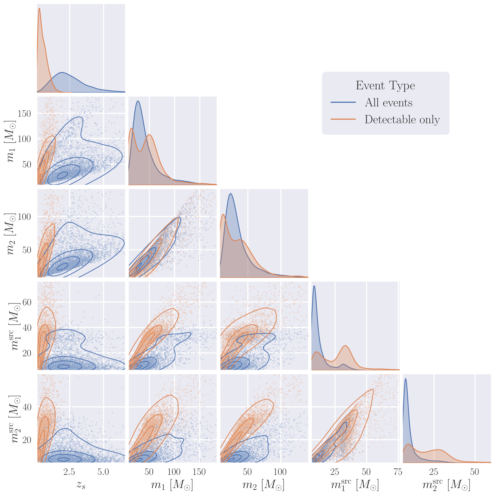

# Analytical Formulation for Gravitational Wave Event Rates

# Analytical Formulation for Gravitational Wave Event Rates

Written by [Phurailatpam Hemantakumar](https://hemantaph.com). Last updated: June 2024.

## Overview

This document presents the analytical framework for calculating gravitational-wave (GW) event rates from compact-binary coalescences (CBCs), encompassing binary black holes (BBH), binary neutron stars (BNS), and neutron star–black hole binaries (NSBH). The formulation integrates cosmic merger rate densities with detector sensitivity functions to predict annual detection rates. Implementation examples using the `ler` package demonstrate practical applications of this framework.

## Table of Contents

- [Introduction](#introduction)
- [Parameter-Marginalized Event Rate](#parameter-marginalized-event-rate)
- [Redshift Distribution and Intrinsic Merger Rates](#redshift-distribution-and-intrinsic-merger-rates)
- [Detection Criterion and SNR Modeling](#detection-criterion-and-snr-modeling)
- [Simulation Results](#simulation-results)
  - [Simulation Settings](#simulation-settings)
  - [GW Source Parameter Priors](#gw-source-parameter-priors)
  - [Plot Comparison for Detectable and Intrinsic Populations](#plot-comparison-for-detectable-and-intrinsic-populations)
  - [Rate Estimates for Different GW Detector Networks](#rate-estimates-for-different-gw-detector-networks)

## Introduction

The annual rate of detectable (unlensed) GW events, $\frac{\Delta N^{\rm obs}_{\rm U}}{\Delta t}$, gives the expected number of observed CBC mergers per year for a given detector network. It is obtained by combining the total intrinsic merger rate in the detector-frame, $\frac{\Delta N_{\rm U}}{\Delta t}$, with the population-averaged probability of detection, $P({\rm obs})$, such that

$$
\begin{equation}
\begin{split}
\frac{\Delta N^{\rm obs}_{\rm U}}{\Delta t}
= \frac{\Delta N_{\rm U}}{\Delta t} \times P({\rm obs}) \,.
\end{split}
\end{equation}
$$

## Parameter-Marginalized Event Rate

The observed event rate is obtained by averaging the detection probability over the compact-binary parameters that determine the emitted signal and its projection onto a detector network. Let $\vec{\theta}=\{\vec{\theta}_{\rm int},\vec{\theta}_{\rm ext}\}$, where the intrinsic parameters $\vec{\theta}_{\rm int}$ describe the binary’s source-frame properties and the extrinsic parameters $\vec{\theta}_{\rm ext}$ describe the source configuration relative to the observer. In this work,

$$ 
\begin{equation}
\begin{split}
\vec{\theta} = \{z_s, m_1, m_2, a_1, a_2, \theta_1, \theta_2, \phi_{12}, \phi_{JL}, \iota, \phi, \psi, {\rm RA}, {\rm Dec}, t_c\} \,,
\end{split}
\end{equation}
$$

where source-frame component masses $(m_1,m_2)$, the dimensionless spin magnitudes $(a_1,a_2)$, and the spin-orientation angles $(\theta_1,\theta_2,\phi_{12},\phi_{JL})$ are intrinsic parameters, while the source redshift $z_s$, the sky position $({\rm RA},{\rm Dec})$, the inclination $\iota$, the polarization angle $\psi$, the coalescence phase $\phi$, and the coalescence time $t_c$ are extrinsic parameters.

Given a joint prior $P(\vec{\theta})$ and a conditional detection probability $P({\rm obs}\mid\vec{\theta})$, the population-averaged detection probability is

$$ 
\begin{equation}
\begin{split}
P({\rm obs}) = \int P({\rm obs}\mid \vec{\theta})\,P(\vec{\theta})\,d\vec{\theta} \,,
\end{split}
\end{equation}
$$

so the annual detectable rate becomes

$$ 
\begin{equation}
\begin{split}
\frac{\Delta N^{\rm obs}_{\rm U}}{\Delta t} = \frac{\Delta N_{\rm U}}{\Delta t} \int P({\rm obs} \mid \vec{\theta})\, P(\vec{\theta})\, d\vec{\theta} \,.
\end{split}
\end{equation}
$$

The priors and parameter ranges used for $P(\vec{\theta})$ are summarized in [Table 1](#table1).

## Redshift Distribution and Intrinsic Merger Rates

The `ler` package uses redshift $z_s$ to represent source distance rather than luminosity distance $D_L$, and assumes that $z_s$ is uncorrelated with the other source parameters. The redshift probability density $P(z_s)$ is defined as the normalized distribution of sources over cosmic history and is proportional to the detector-frame intrinsic merger rate density $\frac{d^2 N}{dt \, dV_c}$ and the comoving volume element $\frac{dV_c}{dz_s}$. Equivalently, using the source-frame intrinsic merger rate density  $\frac{d^2 N}{d\tau dV_c}$ (or $R_{\rm U}(z_s)$), it can be written as

$$
\begin{equation}
\begin{split}
P(z_s) & \propto \frac{d^2 N}{dt \, dV_c} \frac{dV_c}{dz_s} \\
&\propto \frac{d^2 N}{d\tau \, dV_c} \frac{d\tau}{dt} \frac{dV_c}{dz_s} \\
&\propto \frac{R_{\rm U}(z_s)}{(1+z_s)} \frac{dV_c}{dz_s} \,,
\end{split}
\end{equation}
$$

where $R_{\rm U}(z_s)$ is expressed per unit source-frame proper time $\tau$ and per unit comoving volume, with $\frac{d\tau}{dt} = \frac{1}{1+z_s}$. The factor $\frac{1}{1+z_s}$ accounts for cosmological time dilation between the source-frame time $\tau$ and the detector-frame time $t$ (Dominik et al. 2013). The term $\frac{dV_c}{dz_s}dz_s$ represents the comoving shell volume element at redshift $z_s$, and the integration over $z_s$ in the event-rate calculation is carried out over the full redshift range of interest.

Normalizing the redshift distribution introduces the constant ${\cal N}_{\rm U}$, which is equal to the total intrinsic merger rate per year in the detector-frame. The normalized form becomes

$$
\begin{equation}
\begin{split}
P(z_s) = \frac{1}{{\cal N}_{\rm U}} \frac{R_{\rm U}(z_s)}{1+z_s} \frac{dV_c}{dz_s} \,,
\end{split}
\end{equation}
$$

with

$$
\begin{equation}
\begin{split}
{\cal N}_{\rm U} = \int_{z_{\rm min}}^{z_{\rm max}} \frac{R_{\rm U}(z_s)}{1+z_s} \frac{dV_c}{dz_s} \, dz_s \,.
\end{split}
\end{equation}
$$

Using this normalization, the observed event rate can be expressed as the intrinsic detector-frame rate multiplied by the expectation value of the detection probability over the prior distribution,

$$
\begin{equation}
\begin{split}
\frac{\Delta N^{\rm obs}_{\rm U}}{\Delta t}
&= {\cal N}_{\rm U} \int_{\vec{\theta}} P({\rm obs} \mid \vec{\theta}) \, P(\vec{\theta}) \, d\vec{\theta} \\
&= {\cal N}_{\rm U} \bigg\langle P({\rm obs} \mid  \vec{\theta}) \bigg\rangle_{\vec{\theta} \sim P(\vec{\theta})} \,,
\end{split}
\end{equation}
$$

which is evaluated numerically using Monte Carlo integration by drawing samples from $P(\vec{\theta})$. 

For visualization $R_{\rm U}(z_s)$ and $P(z_s)$ are plotted below.

  

>**Figure 1 :** Redshift evolution of the merger rate density $R(z_s)$ (blue, left axis) and the probability density function $P(z_s)$ (orange, right axis) for BBH mergers. Both curves are based on a Madau-Dickinson like model that incorporates time delays and metallicity effects (Ng et al. 2021). The merger rate density is given in $\mathrm{Mpc}^{-3}\,\mathrm{yr}^{-1}$, with the GWTC-4 local rate $R_0 = 1.9^{+0.7}_{-0.5} \times 10^{-8}$ and shaded regions showing the uncertainty bounds. The normalized $P(z_s)$ has no uncertainty band, as the local rate $R_0$ cancels in its calculation. The rate peaks at $z_s \approx 2$, reflecting the cosmic star formation history modulated by metallicity (which suppresses BBH formation at low redshift) and time delays. Both $R(z_s)$ and $P(z_s)$ decline at higher redshifts, providing insight into gravitational wave detection prospects and the cosmic evolution of compact binaries.

## Detection Criterion and SNR Modeling

The conditional detection probability $P({\rm obs} \mid \vec{\theta})$ is determined by applying a detection threshold $\rho_{\rm th}$ to the observed signal-to-noise ratio (SNR) $\rho_{\rm obs}$. In the simplest step-function model, an event is considered detected if its SNR exceeds this threshold. The detection probability is therefore defined as

$$
\begin{equation}
\begin{split}
P({\rm obs} \mid  \vec{\theta}) \equiv P_{\rm det} (\vec{\theta}, \rho_{\rm th}) = 
\Theta[\rho_{\rm obs}(\vec{\theta}) - \rho_{\rm th}] \, ,
\end{split}
\end{equation}
$$

where $\Theta$ is the Heaviside step function. In `ler`, $P_{\rm det}$ is evaluated through the [`gwsnr`](https://gwsnr.hemantaph.com) backend.

To evaluate this criterion, $\rho_{\rm obs}$ is modeled statistically from the optimal SNR $\rho_{\rm opt}$. Common approaches treat $\rho_{\rm obs}$ as either a Gaussian random variable with mean $\rho_{\rm opt}$ and unit variance (Fishbach et al. 2020; Abbott et al. 2019), or as a non-central chi-squared variable (default in `gwsnr` and `ler`) (Essick 2023). The `gwsnr` package computes $\rho_{\rm opt}$ efficiently using interpolation or direct inner products, enabling rapid estimation of $P_{\rm det}$. See the `gwsnr` documentation for details on [detection statistics](https://gwsnr.hemantaph.com/detectionstatistics.html), [optimal SNR](https://gwsnr.hemantaph.com/interpolation.html), and [probability of detection](https://gwsnr.hemantaph.com/probabilityofdetection.html).

>**Note:** $P_{\rm det}$ in `ler` is generic and can be used for any detection problem with an SNR-like statistic, including electromagnetic signal detection (e.g., GRB detectability from BNS mergers; More & Phurailatpam 2024).

## Simulation Results

This section reports results generated with the default configuration of the `ler` package. Although `ler` supports alternative population prescriptions, including user-defined models, all numbers and figures shown here use the standard settings and assumptions summarized below.

### Simulation Settings

All calculations assume a flat $\Lambda{\rm CDM}$ cosmology with $H_0 = 70\,{\rm km}\,{\rm s}^{-1}\,{\rm Mpc}^{-1}$, $\Omega_m = 0.3$, and $\Omega_\Lambda = 0.7$.

Detection probabilities are evaluated through the [`gwsnr`](https://gwsnr.hemantaph.com) backend. Waveforms are generated with the IMRPhenomXPHM approximant, and detector responses are computed with a sampling frequency of $2048\,{\rm Hz}$. The lower frequency cutoff is set to $f_{\rm low}=20\,{\rm Hz}$ for the LIGO–Virgo–KAGRA network at O4 design sensitivity and $f_{\rm low}=10\,{\rm Hz}$ for the third-generation (3G) network consisting of Einstein Telescope (ET) and Cosmic Explorer (CE). The detection threshold is set to $\rho_{\rm th}=10$ for both single detectors and networks. The detector duty cycle is assumed to be 100%.

### GW Source Parameter Priors

The prior distributions and parameter ranges used in the event-rate calculations are summarized in Table 1. These choices follow common conventions in gravitational-wave population analyses and are largely consistent with GWTC-3–motivated models, with local rate normalizations taken from the corresponding GWTC-4 reference values quoted below.

**Table 1: Prior distributions for GW source parameters**

| Parameter | Unit | Prior  Distribution | Range  [Min, Max] | Description |
| :--- | :--- | :--- | :--- | :--- |
| $z_s$ | - | $P(z_s)$  derived from  Madau- Dickinson  SFR | [0, 10] | Source redshift   **BBH** (Ng et al. 2021, GWTC-4) B=2.57, C=3.36, D=5.83,  Median $R_0 = 1.9 \times 10^{-8}\ \mathrm{Mpc}^{-3}\ \mathrm{yr}^{-1}$   **BNS** (M&D 2014, GWTC-4) B=2.7, C=2.9, D=5.6  Median $R_0 = 8.9\times 10^{-8} {\rm Mpc}^{-3}\,{\rm yr}^{-1}$ |
| $m_{1,2}$ | $M_\odot$ |    **BBH** PowerLaw +Peak   **BNS** Bimodal- Gaussian |   **BBH** [4.98, 112.5]   **BNS** [1.0, 2.3]  | Component masses  (source-frame)  **BBH** (GWTC-3) $\alpha$=3.78, $\mu_g$=32.27, $\sigma_g$=3.88,  $\lambda_p$=0.03, $\delta_m$=4.8, $\beta$=0.81  **BNS** (Farr et al. 2020) $w$=0.643, $\mu_L$=1.352,  $\sigma_L$=0.08, $\mu_R$=1.88, $\sigma_R$=0.3 |
| $a_{1,2}$ | - | Uniform | [0, 0.99] | Dimensionless spin magnitudes |
| $\theta_{1,2}$ | rad | Sine | [0, $\pi$] | Spin vector tilt angles |
| $\phi_{12}$ | rad | Uniform | [0, $2\pi$] | Azimuthal angle between spin vectors |
| $\phi_{JL}$ | rad | Uniform | [0, $2\pi$] | Angle between total and orbital  angular momentum |
| RA | rad | Uniform | [0, $2\pi$] | Right ascension |
| Dec | rad | Cosine | [$-\frac{\pi}{2}$, $\frac{\pi}{2}$] | Declination |
| $\iota$ | rad | Sine | [0, $\pi$] | Inclination relative to line of sight |
| $\psi$ | rad | Uniform | [0, $\pi$] | GW signal polarization angle |
| $\phi$ | rad | Uniform | [0, $2\pi$] | Coalescence orbital phase |
| $t_c$ | s | Uniform | [0, 1 yr] | Coalescence time within a year |

### Plot Comparison for Detectable and Intrinsic Populations

Selection effects in gravitational-wave observations are illustrated by comparing the intrinsic BBH population to the subset that satisfies the detectability criterion for a given detector network.

  

>**Figure 2:** Corner plot comparing the simulated intrinsic BBH population (blue) with the detectable subset (orange) for the LIGO–Virgo–KAGRA network (['L1', 'H1', 'V1']) at O4 design sensitivity. The population model assumes a Madau–Dickinson–like merger-rate density (see [Figure 1](#fig1)) and a PowerLaw+Peak component-mass distribution. Shown parameters are the source redshift $z_s$ and component masses $m_1$ and $m_2$ (in $M_\odot$). The detectable subset is biased toward lower redshift and higher masses because these systems typically yield larger network SNR. Orientation effects, which also modulate SNR through the antenna pattern and inclination, are not shown.

## Rate Estimates for Different GW Detector Networks

Estimated annual merger rates for BBH and BNS populations are listed below for two detector configurations under the population and detection settings described above.

| Detector Configuration | BBH (Pop I–II)  Merger Rate (${\rm yr}^{-1}$) | BNS  Merger Rate (${\rm yr}^{-1}$) | Ratio  BBH:BNS |
| :--- | :--- | :--- | :--- |
| [L1, H1, V1] (O4) | 292.7 | 7.4 | 39.5 |
| [CE, ET] (3G) | 88716 | 149307 | 0.6 |

>**Notes:** O4 design sensitivity and 100% duty cycle are optimistic assumptions for the LIGO–Virgo–KAGRA network. Rates are likely overestimated compared to real observing runs. 