====================
Code overview
====================

The diagram below summarizes the main internal workflow of ``ler``: how the
public classes connect to the source-population samplers, lens-population
samplers, image solver, detectability calculation, rate estimators, and
JSON outputs.

Simplified workflow
-------------------

.. Detailed workflow
.. -----------------

.. .. container:: scrollable-image code-overview-flowchart

..    .. image:: _static/ler_flowchart.svg
..       :align: center
..       :width: 1000px
..       :alt: Flowchart of the internal workflow of ler (detailed version)

Main entry points
-----------------

``GWRATES`` handles unlensed compact-binary population sampling and detection
rates. ``LeR`` extends that workflow to strongly lensed events by adding lens
galaxy sampling, optical-depth weighting, image-property calculations, and
image-level detectability.

The same source-population machinery is used in both paths. The lensed path
adds lens parameters and transforms each lensed image into effective GW
parameters before applying the same detection-probability and rate machinery.
